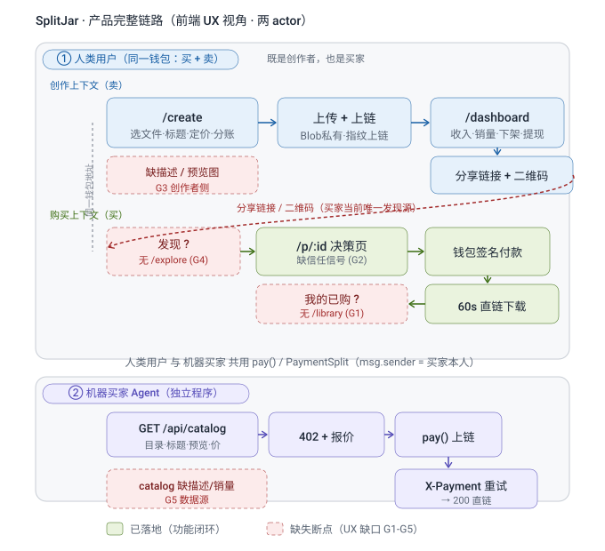

# SplitJar · 前端用户交互体验与产品完整链路分析

> 文档定位：**UX 研究 + 交互设计文档**（非代码实现）。
> 面向：前端用户交互体验；范围：产品完整链路（创作者 / 人类买家 / 机器买家三角色端到端）。
> 方法依据：JTBD、Nielsen 启发式（0–4 级严重度）、HEART + GSM、KANO、WCAG 2.1 AA、Impact×Effort 优先级矩阵。
> 现状依据：基于仓库**当前真实源码**逐页核对（`src/App.tsx` 路由、`src/components/Shell.tsx` 壳与导航、`src/pages/PayPage.tsx` / `CreatePage.tsx` / `ConsolePage.tsx` / `DashboardPage.tsx`）。

---

## 0. 结论速览（给决策者先看）

SplitJar 的**功能性内核已闭环且上链验证**：创作者能发内容、买家能付、钱按比例直达、已购可再取、创作者能下架与收款。但**前端"可发现 → 可决策 → 可复访"这一圈对买家是断的**：

- **买家没有"发现/浏览"入口**（无 `/explore`）：所有购买都依赖创作者手动发的链接/二维码，买家无法在应用内逛。
- **买家没有"我的已购"页**（无 `/library`）：买过之后没有归拢处，复访与"再打开"只能靠记链接。
- **买家决策页缺信任信号**：付费页只有标题（且来自链接/localStorage，非链上）、价格、分账表；**没有描述、没有预览图、没有销量、没有创作者身份校验**。
- **创作者侧同样缺描述与预览图上传**：`CreatePage` 自己写着"预览图还没做"，描述字段不存在。

按 Nielsen 严重度，上述前两条是 **3 级（上线前高优修复）**，信任信号缺失是 **2 级（需修复但可容忍）**。完整优先级见 §6。

---

## 1. 用户画像（Persona · 五要素）

### P1 · 创作者（内容供给方）
| 要素 | 描述 |
|---|---|
| 姓名/人口 | 李明，28 岁，独立数字产品作者（模板/素材/课程/AI 写真），技术尚可但不深 |
| 行为 | 用 `/create` 发内容；用分享链接 + 二维码分发给私域（闲鱼/小红书）；用 `/dashboard` 看收入、下架、提现 |
| 目标/动机 | 把一次性劳动变成可重复售卖的资产；钱直接到自己钱包、不被平台抽成 |
| 痛点 | 发完没有"陈列橱窗"；买家来了没决策依据；不知道谁买了、卖了多少 |
| 场景 | ① 做完一套 PPT 模板，设置 70/20/10 分账并上链；② 小红书发帖带付费页二维码；③ 一周后看 `/dashboard` 谁付了、提现 |

### P2 · 人类买家（终端消费者）
| 要素 | 描述 |
|---|---|
| 姓名/人口 | 小雅，24 岁，手机为主的内容消费者，对 Web3 不熟悉 |
| 行为 | 扫码/点链接进入 `/p/:id`；连钱包（Core/MetaMask）；付测试网 USDC；下载内容 |
| 目标/动机 | 快速拿到想要的数字内容；别付错、别买亏、别退款无门 |
| 痛点 | 落地页"看不出这是啥、值不值"；没有销量/评价佐证；买过之后找不到入口 |
| 场景 | ① 朋友圈扫到二维码 → 手机付款；② 想再找上次买的设计素材 → 找不到；③ 犹豫"这作者靠谱吗" → 离开 |

### P3 · 机器买家（AI Agent · 作为"用户"）
| 要素 | 描述 |
|---|---|
| 姓名/人口 | 自主代理程序，持私钥在自己的 shell 里签名 |
| 行为 | `GET /api/catalog` → 402 报价 → `pay()` → 带 `X-Payment` 重试 → 200 直链 |
| 目标/动机 | 按指令自动采购内容，无需登录/钱包插件 |
| 痛点 | 目录里缺描述/预览，agent 难以"挑"内容（只能硬编码 URL，演示显假） |
| 场景 | 脚本 `--dry-run` 跑通四步不花钱；去 `--dry-run` 真付一笔 |

> **画像一致性说明**：三条链路走的是同一个 `pay(bytes32)` 与同一个 `PaymentSplit` 事件（`DashboardPage` 已用地址白名单区分 Agent 购买）。人类与 Agent 共用合约，差异只在"谁签交易"。
> **身份合一说明**：P1 创作者与 P2 人类买家在链上是**同一钱包**——同一个人既卖也买。因此产品 IA 应让「创作」与「购买」共存于一个登录态（见 §2 与流程图），而非两套互斥角色；纯买家（从没发布过内容）可用渐进显现先隐藏创作入口。

---

## 2. 产品完整链路总览（端到端）

下图以**两泳道**呈现端到端链路：① 人类用户（同一钱包，内含「创作 / 卖」与「购买 / 买」两个上下文）；② 机器买家 Agent（独立程序）。红色虚线标注当前 UX 断点（G1–G5）。绿色节点＝已落地，红色虚线＝待补缺口。



> 图例：蓝色＝人类用户·创作上下文，绿色＝人类用户·购买上下文，紫色＝机器买家 Agent；人类用户两个上下文由左侧「同一钱包地址」纵向虚线相连（即创作者与买家是**同一个人**）；跨上下文红色虚线弧表示「分享链接 / 二维码」当前是买家唯一的发现来源；G1–G5 断点定义与优先级见 §6。

> **关键修正**：「创作者」与「人类买家」并非两类账号，而是**同一钱包地址的两种使用上下文**——同一个人既能发内容也能买内容。因此下文 2.1 与 2.2 同属「人类用户」这一 actor，仅情境不同；真正独立的第二 actor 是 2.3 的机器买家（独立程序）。

### 2.1 人类用户 · 创作上下文（卖）
```
构思 → /create(选文件+标题+定价+分账) → 上传 Blob(private) → createContent(上链)
     → /dashboard(看收入/销量/下架/提现) → 分享 /p/:id 链接+二维码 → 买家付款
```
- 已落地：文件指纹上链、分账、上下架（`ActiveToggle`）、收入与销量（读 `PaymentSplit`）、提现（`pendingBalance`）。
- **断点 ★**：创建时不收集"描述"与"预览图"（`CreatePage` 提示"预览图还没做"），导致下游买家决策页无素材。

### 2.2 人类用户 · 购买上下文（买）
```
发现(?) → /p/:id(决策) → 钱包签名付款 → 60s 直链下载 → 我的已购(?)
```
- 已落地：扫码落地、`BuyerShell` 移动优先、骨架屏防白屏、分账透明展示、不退款提示、已购可再取（闸门 `blocked`→`download`）。
- **断点 ★**：① "发现"无入口；② 决策页信任信号缺失；③ "我的已购"无页。

### 2.3 机器买家 Agent（独立程序，非 UI）
```
GET /api/catalog → 402+quote → approve+pay(上链) → GET /api/content/:id + X-Payment → 200 直链
```
- 已落地（`api/catalog` 扫 `ContentRegistered`/`ContentActiveChanged` + Blob 预览；`api/content/:id` 五校验 + 交付）。
- **断点 ★**：`catalog` 目前返回 `title/previewUrl/price/creator`，**不含 `description`/`salesCount`**，agent 难以"挑"，也削弱人类买家浏览页的数据源。

### 链路健康度小结
| 链路 | 内核 | 前端体验闭环 | 最大断点 |
|---|---|---|---|
| 创作者 | ✅ 上链验证 | 🟡 能发能管，缺陈列素材 | 无描述/预览 |
| 人类买家 | ✅ 能付能取 | 🔴 断在发现与复访 | 无 /explore、无 /library、无信任信号 |
| 机器买家 | ✅ 自动采购 | 🟢 API 完整 | catalog 缺描述/销量 |

---

## 3. 用户旅程地图（6 列：阶段 / 行为 / 触点 / 情绪 / 痛点 / 机会）

### 3.1 人类买家旅程
| 阶段 | 行为 | 触点 | 情绪 | 痛点 | 机会 |
|---|---|---|---|---|---|
| 发现 | 扫/点链接进入 | 分享二维码、`/p/:id` | 期待 | 只因别人发才来，无主动浏览 | `/explore` 陈列橱窗 |
| 决策 | 看标题/价格/分账 | `PayPage` | 犹豫 | 无描述/预览/销量，"值不值"无据 | 信任信号区 |
| 付款 | 连钱包、签名 | `PayPage` 按钮 | 紧张 | 怕付错、怕不退款 | 不退款提示(已有)+ 分账透明(已有) |
| 取货 | 下 60s 直链 | `PayStatus` 下载 | 释然 | 链接有时效，易丢 | 下载落 `/library` |
| 复访 | 想再看/再下 | （无入口） | 挫败 | 找不到买过的东西 | `/library` 我的已购 |

### 3.2 创作者旅程
| 阶段 | 行为 | 触点 | 情绪 | 痛点 | 机会 |
|---|---|---|---|---|---|
| 构思 | 定内容/价/分账 | `/create` | 专注 | 分账填错被拦(可接受) | 保持"拦下"设计 |
| 创建 | 上传+上链 | `CreatePage` | 等待 | 无预览图/描述字段 | 补描述+预览上传 |
| 分享 | 发链接/码 | `ShareRow` | 满意 | 内容无"卖相" | 描述/预览进分享卡 |
| 管理 | 看收入/下架 | `/dashboard` | 掌控 | 标题靠本机，换机空白 | 标题上链/KV(已有端点) |
| 收款 | 提现 | `ClaimPending` | 踏实 | — | — |

---

## 4. 信息架构（IA）

### 4.1 现状拓扑
```
/                (AppShell)  控制台       [创作者]
/create          (AppShell)  创建付费内容  [创作者]
/dashboard       (AppShell)  收款/我的内容 [创作者]
/p/:id           (BuyerShell)付费页       [买家]
*                → 重定向到 /
```
- 顶部导航（仅创作者）：控制台 / 内容 / 收款（`Shell.tsx` `TopNav`）。
- 买家壳隐藏全部创作者导航（`BuyerShell` 只留 logo + 连接钱包），正确（Nielsen 一致性与"识别胜于回忆"）。

### 4.2 目标拓扑（补两端到端的买家闭环）
```
创作者侧（AppShell + 顶部 Tab）
  /            控制台
  /create      内容（含描述 + 预览图上传）
  /dashboard   收款 / 我的内容
买家侧
  /p/:id       付费页（增强信任信号）
  /explore     发现 / 浏览（新增 ★ P0/P1）
  /library      我的已购（新增 ★ P0）
```
- 不引入 `/u/:address` 创作者店铺页（本版范围外，KANO"无差异型"，可后置）。

### 4.3 导航与跨页流方案
- **创作者 Tab 保持三枚**，不动（`/explore`、`/library` 是买家视角，不进创作者 Tab）。
- **买家如何进入 `/explore` 与 `/library`**：`BuyerShell` 顶部在 logo 旁加两个轻量入口（"发现""我的"）；付费成功后的 `PayStatus` 增加"查看我的已购"CTA，形成"付完→落袋"的闭环。
- **分享闭环**：`CreatePage` 成功页已有分享链接/码；补充"去陈列页看看"入口（若已发布到 /explore）。

### 4.4 标签命名规则（建议卡片分类验证）
- 发现 vs 浏览：用"发现"更贴近"逛"的心智（Hick 定律：少即快）；避免"市场/商店"等重词。
- 我的已购 vs 我的内容：买家用"已购"，创作者用"我的内容"，角色对齐，避免混淆。

---

## 5. 前端交互走查（Nielsen 启发式 + 严重度 0–4）

| # | 页面 | 原则 | 现状 | 问题 | 严重度 |
|---|---|---|---|---|---|
| F1 | 全局 | 系统状态可见性 | 加载有骨架屏、错误区分"读链失败≠无数据" | 良好 | 0 |
| F2 | `PayPage` | 识别胜于回忆 | 标题来自 `?t=`/localStorage，无描述/预览 | 买家到页"不知买的是什么" | 2 |
| F3 | `PayPage` | 用户控制与自由 | 已下架不渲染假按钮、已购给下载 | 良好 | 0 |
| F4 | 全局 | 一致性与标准 | 创作者/买家壳分离正确 | 良好 | 0 |
| F5 | 导航 | 灵活性与效率 | 无买家发现/已购入口 | 买家无法主动浏览、无法复访 | 3 |
| F6 | `CreatePage` | 防错原则 | 分账合计拦死、重复地址仅警告 | 良好 | 0 |
| F7 | `CreatePage` | 审美与极简 | 提示"预览图还没做" | 创作者无陈列素材，下游受损 | 2 |
| F8 | `ConsolePage` | 帮助与文档 | 有 `Checklist`(W1 完成定义·开发计划)、`演示账户的状态` | **开发态痕迹未清理**，误导用户 | 1 |
| F9 | `DashboardPage` | 识别胜于回忆 | 标题来自 localStorage，换机空白 | 创作者自己也可能看不到标题 | 2 |
| F10 | `PayPage` | 用户控制与自由 | 无"销量/评价"佐证 | 新买家无社会证明，犹豫离开 | 2 |

> 严重度定义（Nielsen）：0 非问题 / 1 小 / 2 中 / 3 重大(上线前修) / 4 灾难。

---

## 6. UX 缺口与闭环补全（优先级）

### 6.1 缺口清单
| 编号 | 缺口 | 对应链路断点 | 建议 |
|---|---|---|---|
| G1 | 买家无"我的已购"页 | §2.2 断点③ | 新增 `/library`，按购买时间排序，可再打开取内容（含已下架项，遵循"下架不影响已购"） |
| G2 | 买家决策缺信任信号 | §2.2 断点② / F2,F10 | `PayPage` 加：描述、预览图、销量、创作者身份校验 |
| G3 | 创作者无描述/预览上传 | §2.1 断点★ / F7 | `CreatePage` 加描述 textarea + 预览图上传（复用 `authorizeUpload`/`directUpload` 的 `target:'preview'`） |
| G4 | 买家无发现页 | §2.2 断点① / F5 | 新增 `/explore`，网格陈列（预览+标题+价格+销量+创作者），数据源 `GET /api/catalog` |
| G5 | 分享链接缺描述 | §3.2 分享机会 | 描述随 `POST /api/content-meta` 写入 KV，单条 `GET /api/content-meta` 供决策页拉取 |
| G6 | 导航/页面含开发痕迹 | F8 | 清理 `ConsolePage` 的"W1 完成定义·开发计划""演示账户的状态"等 dev trace |

### 6.2 优先级（P0/P1/P2）
| 编号 | 优先级 | 理由 |
|---|---|---|
| G1 `/library` | **P0** | 复访闭环缺失，Nielsen 3 级；无它买家"买完即丢" |
| G2 信任信号 | **P0** | 决策无据直接拉低付款完成率（Task Success） |
| G4 `/explore` | **P0/P1** | 主动获客入口；演示"可发现"必需，否则 agent 也只能硬编码 |
| G3 描述/预览 | **P1** | 上游素材，支撑 G2/G4；创作者体验加成 |
| G5 单条 meta GET | **P1** | 支撑 G2 决策页拉描述 |
| G6 清理痕迹 | **P2** | 不阻断功能，但损害专业感 |

### 6.3 Impact × Effort 矩阵
```
高 Impact ┌ P0:G1 /library      P0:G2 信任信号
          │ P0:G4 /explore
          │
          │ P1:G3 描述/预览     P2:G6 清理痕迹
低 Impact └ P1:G5 meta GET
            低 Effort ──────────────── 高 Effort
```
- **先做 P0**（G1/G2/G4）：直接闭合买家"发现→决策→付款→复访"圈。
- **P1**（G3/G5）与 P0 同源：描述/预览数据通了，G2/G4 才有料。
- **P2**（G6）收尾。

---

## 7. 信任信号设计（买家决策页 · G2）

信任信号 = "让一个不认识作者的买家敢付钱"的信息。四项，按 KANO 分类：
- **必备型**：不退款提示（已有，保留）、价格与分账透明（已有，保留）。
- **期望型**：描述、预览图、销量。
- **魅力型**：创作者身份校验（ENS/域名）、评价。

| 信号 | 数据来源 | 现状 | 设计 |
|---|---|---|---|
| 描述 | 创作者 KV（`POST /api/content-meta` 扩 `description`） | 无 | 决策页"关于这件内容"段落，截断 280 字 |
| 预览图 | Blob public store（`preview/<contentId>`） | catalog 已有 `previewUrl`，决策页未用 | 决策页顶部大图 |
| 销量 | 链上 `PaymentSplit` 计数 | 创作者侧 `/dashboard` 有，买家侧无 | catalog 加 `salesCount`；决策页"已有 N 人购买" |
| 创作者 | 链上 `creator` 地址 | 仅分账表里 | 决策页展示"创作者"地址 + 可选 ENS；与分账表"创作者"行呼应 |

> **原则**：信任信号全部来自链上或 KV，无中心化数据库（与产品"无平台抽成、无资金池"一致）。销量用 `PaymentSplit` 同义计数，不另建库。

---

## 8. 页面级交互规范（设计稿，非代码）

### 8.1 `/explore` 发现页（G4）
- **布局**：响应式网格（`sm:2 / lg:3` 列），卡片 = 预览图(16:9) + 标题 + 价格 + 销量 + 创作者缩写。
- **数据**：`GET /api/catalog`（仅 `active` 且在售）。
- **状态**：加载骨架屏；空态"还没有内容上架"；链上读取失败显"重试"而非"无数据"。
- **交互**：点卡片 → `/p/:id`；移动端单列、大点击区（Fitts）。
- **排序/筛选（P2 增强）**：按最新/销量；按创作者筛选。

### 8.2 `/library` 我的已购（G1）
- **入口**：`BuyerShell` 顶部"我的"；付款成功后 CTA。
- **数据**：按买家地址扫 `PaymentSplit`（服务端 `GET /api/my-purchases?payer=`）。
- **布局**：列表按购买时间倒序；每项 = 预览/标题 + 价格 + "购买于 <时间>" + "打开/重新下载"。
- **关键语义**：含已下架项（"下架不影响已购"），仍可再取；未连钱包显引导。

### 8.3 `PayPage` 增强（G2）
- **顶部**：预览图 + 标题（保留 `?t=`/localStorage 兜底）。
- **信任区**：描述段落 + "已有 N 人购买" + "创作者 <地址/ENS>"。
- **保留**：分账透明表、不退款提示、骨架屏、已购给下载、已下架不给假按钮（现有守卫全部保留）。
- **移动优先**：`BuyerShell max-w-md` 不变；信任区在首屏折叠线内（"识别胜于回忆"）。

### 8.4 `CreatePage` 增强（G3）
- **描述**：标题下方加 textarea（`maxLength 280`），实时字数。
- **预览图**：文件选择旁加"上传预览图"（复用 `authorizeUpload`/`directUpload`，`target:'preview'`，图片类型、≤8MiB）。
- **实时预览**：右侧"这会生成什么"卡展示描述 + 预览图 + 分账（现有卡扩展）。
- **发布后**：描述 + 预览随内容一起可被 `/explore`、决策页消费。

### 8.5 导航与跨页流（G6 之外）
- 创作者 Tab 不动；买家 `BuyerShell` 加"发现/我的"两个入口。
- 分享成功页补"去陈列页看看"（若已发布）。

---

## 9. 可访问性（WCAG 2.1 AA）

- **对比度**：正文/ muted 文本对比度 ≥ 4.5:1；accent 红仅用于动作，不承载信息。
- **键盘可达**：所有导航/按钮可 Tab 聚焦、可见焦点环；`ActiveToggle`、分享复制可键盘操作。
- **语义与 ARIA**：骨架屏 `aria-busy`/`aria-label`（现有已做）；错误用 `role="alert"`；图片 `alt` 含标题。
- **移动 375px**：`BuyerShell` 已满足；`/explore` 单列大点区（Fitts）。
- **状态可见性**：加载/错误/成功三态文案齐全，不靠颜色 alone 区分（如"已下架"配文字+琥珀色）。

---

## 10. 成功指标（HEART + GSM）

| HEART 维度 | 信号 | 指标 | 目标(建议基线) |
|---|---|---|---|
| Happiness | 满意 | 付款后 CSAT / 不退款投诉率 | CSAT ≥ 4/5 |
| Engagement | 留存/活跃 | `/library` 月访问率、复访率 | 复访 ≥ 30% 已购用户 |
| Adoption | 新功能渗透 | `/explore`、`/library` 打开率 | 新买家 ≥ 50% 经过发现页 |
| Retention | 流失 | 30 日复购率 | D30 ≥ 20% |
| Task Success | 完成/错误 | 付款完成率、错误率 | 完成率 ≥ 85%，错误率 ≤ 5% |

**GSM 映射**（示例）：目标=买家敢付 → 信号=决策页停留与付款转化 → 指标=带信任信号的付款完成率。

---

## 11. 验证方案

### 11.1 可用性测试（走廊测试，每类 5 人）
- 任务 1（买家）：通过 `/explore` 找到一件内容并付款 → 测发现→决策→付款完成率。
- 任务 2（买家）：买完后从"我的已购"重新打开内容 → 测复访闭环。
- 任务 3（创作者）：创建带描述+预览的内容并分享 → 测上游素材闭环。
- 通过标准：任务 1/2 完成率 ≥ 85%；单个用户发现的问题 ≤ 2 个 3 级以上。

### 11.2 A/B 假设（决策页信任信号）
- 假设：决策页加"描述+预览+销量"后，付款完成率提升 ≥ 10%。
- MDE = 10%，α = 0.05，power = 0.8 → 按比例算样本量（漏斗/A/B 计算器）。
- 护栏指标：不退款投诉率不升、加载时长不变。

---

## 12. 落地建议（给未来的实现，非本任务范围）

> 本节仅描述"要做什么"，不在本会话落地（用户要求只出文档）。

1. **P0 先行**：`/library` + `/explore` + `PayPage` 信任信号，闭合买家圈。
2. **同源数据**：`POST /api/content-meta` 扩 `description` + 单条 `GET`；`catalog` 加 `salesCount`；`/my-purchases` 扫 `PaymentSplit`(按 payer)。
3. **P1**：`CreatePage` 描述 + 预览上传；`/explore` 排序筛选。
4. **P2**：清理 `ConsolePage` 开发痕迹；可选 `/u/:address` 创作者店铺页。

**依赖与风险**：描述/预览数据若不上链/KV，G2/G4 会"有页无料"——务必先通数据再通页。

---

## 附：与既有文档关系
- 本文档是前端 UX 与完整链路的**整合分析**，承接 `完成度分析.md`（功能完成度）与 `UX闭环分析与补全.md`（缺口与 W13 计划）的结论，并把"要做什么"收敛为可验证的设计规范（§7–§11）。
- 代码改动不在本会话进行；任何实现须以本文档 §6 优先级与 §8 规范为准。
